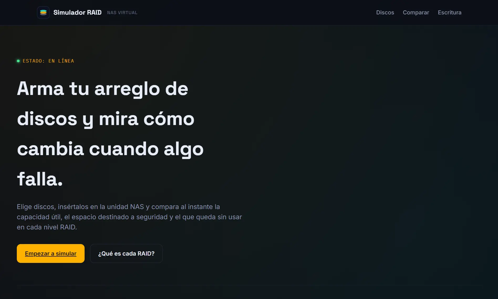

# 🖴 Simulador RAID

Simulador web interactivo de arreglos RAID (NAS virtual) que permite armar un arreglo de discos, comparar niveles RAID en paralelo, ver cómo se escriben los datos disco por disco y **simular fallas de disco en tiempo real** para observar si el arreglo pierde datos o los reconstruye gracias a la redundancia.

🔗 **Sitio en vivo:** [alexander404-hz.github.io/Simulador-RAID](https://alexander404-hz.github.io/Simulador-RAID/)

[](https://alexander404-hz.github.io/Simulador-RAID/)

---

## ✨ Funcionalidades

### 1. Armado del arreglo (bahías + chasis virtual)

- Paleta de discos de distintas capacidades (500 GB a 10 TB) para insertar en las bahías del NAS.
- Chasis visual con riel de LEDs y hasta 10 bahías (6 en pantallas compactas), responsive para desktop, tablet y móvil.
- Cada disco insertado puede:
  - **Expulsarse** (quitarlo del arreglo).
  - **Apagarse / encenderse** con un botón de energía, simulando una **falla física** del disco sin necesidad de retirarlo.
- Los discos caídos se marcan visualmente (LED en rojo, bahía atenuada, etiqueta "FALLO").

### 2. Simulador de escritura de datos

- Escribe cualquier texto y elige un nivel RAID para ver **disco por disco** dónde queda cada bloque de datos, dónde se duplica (mirroring) y dónde vive la paridad (XOR).
- Todo es **reactivo**: al escribir (con un pequeño _debounce_ para no recalcular en cada tecla) o al cambiar el nivel RAID, la simulación se actualiza sola, sin botones.
- Modo binario opcional para ver cada carácter en su representación de 8 bits.
- **Simulación de fallas en vivo**: si apagas un disco desde la sección 1, sus columnas se marcan como caídas y cada celda cambia dinámicamente a:
  - 🟠 **Reconstruido** — el dato sigue disponible porque el RAID puede recuperarlo desde su copia o su paridad.
  - 🔴 **Perdido** — el dato ya no es recuperable con la redundancia restante.
- Un banner de estado explica en una frase qué está pasando (ej. _"1 disco caído: la paridad reconstruye en vivo los datos que faltan."_).

### 3. Comparador de niveles RAID

Compara dos arreglos en paralelo usando el mismo set de discos, bajo dos niveles RAID distintos:

| Nivel       | Descripción                                                   |
| ----------- | ------------------------------------------------------------- |
| **RAID 0**  | Striping — máximo rendimiento y capacidad, sin redundancia.   |
| **RAID 1**  | Espejo (mirroring) — duplica cada bloque en todos los discos. |
| **RAID 3**  | Paridad dedicada a nivel de byte, un disco fijo para paridad. |
| **RAID 5**  | Paridad distribuida y rotativa entre discos.                  |
| **RAID 01** | Espejo de divisiones (mirror de dos grupos en striping).      |
| **RAID 10** | División de espejos (striping de varios pares en mirror).     |

Para cada panel se muestra en vivo:

- Capacidad útil, espacio de seguridad y espacio sin usar (con gráficos de dona y de barras vía Chart.js).
- Validaciones de la cantidad mínima/paridad de discos que exige cada nivel.
- **Badge de estado de tolerancia a fallos** (`Operativo` / `Degradado — se reconstruye` / `Pérdida de datos`) que se recalcula al instante según qué discos estén encendidos o apagados.

### 4. Guía de niveles RAID

Modal con tarjetas explicativas de cada nivel RAID (0, 1, 3, 5, 01 y 10), con diagramas SVG y una breve descripción de cómo distribuye los datos y qué tolerancia a fallos ofrece.

---

## 🧠 Lógica de tolerancia a fallos

El simulador evalúa, para cada nivel RAID y cada combinación de discos caídos, si los datos:

- **Sobreviven íntegros** (`ok`)
- **Se pueden reconstruir** (`degradado`) — usando la copia (mirror) o la paridad (XOR) disponible.
- **Se pierden** (`perdida`) — cuando la falla supera lo que el nivel RAID puede tolerar.

| RAID    | Tolera                                                                                                         |
| ------- | -------------------------------------------------------------------------------------------------------------- |
| 0       | Ningún disco caído.                                                                                            |
| 1       | Todos menos uno (mientras quede al menos una copia viva).                                                      |
| 3 / 5   | Un (1) disco caído — se reconstruye vía paridad.                                                               |
| 10 / 01 | Un disco caído por pareja espejada — si ambos discos de una misma pareja caen, esa porción de datos se pierde. |

---

## 🛠️ Tecnologías

- **HTML5** semántico
- **CSS3** (sin frameworks, variables CSS y diseño responsive propio)
- **JavaScript** (ES6+, sin frameworks)
- **[Chart.js](https://www.chartjs.org/)** para las gráficas de dona y de barras
- Tipografías vía Google Fonts: `Space Grotesk`, `IBM Plex Mono`, `Inter`

---

## 📁 Estructura del proyecto

```
.
├── index.html
└── assets/
    ├── css/
    │   └── styles.css
    ├── js/
    │   └── app.js
    └── img/
        ├── disco.webp
        ├── nas-desktop.webp
        ├── nas-tablet.webp
        ├── nas-movil.webp
        ├── disc-inserted.webp
        └── disc-inserted-vertical.webp
```

---

## 🚀 Cómo correrlo localmente

No requiere instalación de dependencias ni build. Basta con servir la carpeta con cualquier servidor estático, por ejemplo:

1. Clona el repositorio:

   ```bash
   git clone https://github.com/alexander404-hz/Simulador-RAID.git
   ```

2. Entra a la carpeta del proyecto:

   ```bash
   cd Simulador-RAID
   ```

3. Abre `index.html` directamente en tu navegador, o usa una extensión como **Live Server** (VS Code) para servirlo localmente.

---

## 📱 Responsive

El simulador se adapta a tres puntos de quiebre:

- **Desktop** (> 900px): hasta 10 bahías, chasis en vista horizontal.
- **Tablet** (≤ 900px): hasta 6 bahías, chasis compacto.
- **Móvil** (≤ 480px): chasis vertical, controles apilados y scroll horizontal seguro (sin recortar contenido) en la grilla de escritura cuando el arreglo usa muchas columnas (RAID 10/01).

---

## 🌐 Despliegue

El proyecto se despliega en **GitHub Pages** desde este mismo repositorio.

---

## 👤 Autor

**Alexander Hernández**
Portafolio: [alexander404-hz.github.io/Portafolio](https://alexander404-hz.github.io/Portafolio/)

---

## 📄 Licencia

© 2026 Alexander Hz. Todos los derechos reservados.
